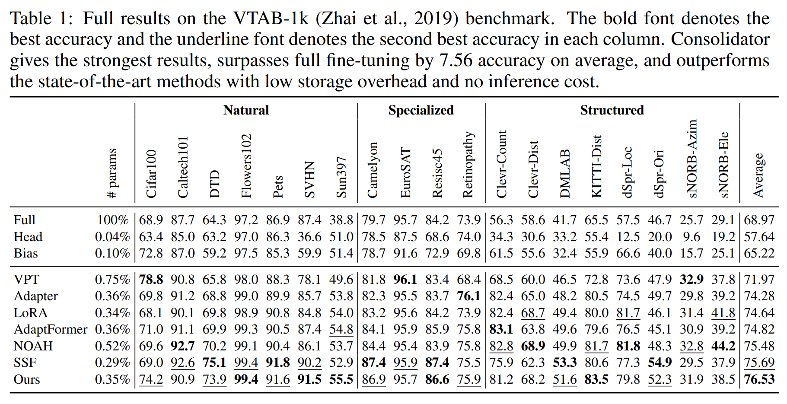

<div align="center">

<h1>Consolidator: Mergeable Adapter with
Grouped Connections For Visual Adaptation (ICLR-2023)</h1>

</div>

Official implementation for ICLR 2023 paper [Consolidator: Mergeable Adapter with
Grouped Connections for Visual Adaptation](https://arxiv.org/abs/2305.00603)

## TL;DR

To enrich model capacity with limited storage budget, we design a module consolidator enabling two-stage consolidation process: 1. between adaptation and storage and 2. between loading and inference. 
Such paradigm can reach better performance using quite few parameters, and bring no extra inference cost. 


## Environment Setup
```
conda create -n consolidator python=3.8
conda activate consolidator
pip install torch==1.8.0+cu111 torchvision==0.9.0+cu111 torchaudio==0.8.0 -f https://download.pytorch.org/whl/torch_stable.html
pip install mmcv==1.3.11 -f https://download.openmmlab.com/mmcv/dist/cu111/torch1.8/index.html
pip install -r requirements.txt
```

## Data Preparation

```
cd data/vtab-source
python get_vtab1k.py
```

## Quick Start

### 1. Downloading the pre-trained checkpoints

Download [ViT-B](https://storage.googleapis.com/vit_models/imagenet21k/ViT-B_16.npz) and [MoCo v3 ViT-B](https://dl.fbaipublicfiles.com/moco-v3/vit-b-300ep/vit-b-300ep.pth.tar) to ```ckpts/```.


### 2. Training
```
bash configs/Consolidator/VTAB/train_consolidator_vtab.sh
```

### 3. Converting
When you want to convert a consolidator to a normal linear layer, the equivalent weight and bias are:
```
m = Consolidator(768, 768, fc_groups=(384,), rep_drop=0.5, with_channel_shuffle=True)
weight, bias = m.get_actual_params()
```
You can verify the result by
```
import torch
import torch.nn.functional as F
x = torch.randn(64, 197, 768)
m.eval()
out1 = m(x)
out2 = F.linear(x, weight, bias)
print('Difference:')
print(((out2 - out1) ** 2).sum())
```

### 4. Main Results


## Citation
```
@inproceedings{
    hao2023consolidator,
    title={Consolidator: Mergable Adapter with Group Connections for Visual Adaptation},
    author={Tianxiang Hao and Hui Chen and Yuchen Guo and Guiguang Ding},
    booktitle={The Eleventh International Conference on Learning Representations },
    year={2023},
    url={https://openreview.net/forum?id=J_Cja7cpgW}
}
```

## Contact
If you have any question, please contact beyondhtx@gmail.com.

## Acknowledgments
The code of this repository is based on [NOAH](https://github.com/ZhangYuanhan-AI/NOAH) and [timm](https://github.com/rwightman/pytorch-image-models).

Thanks for their great works.


